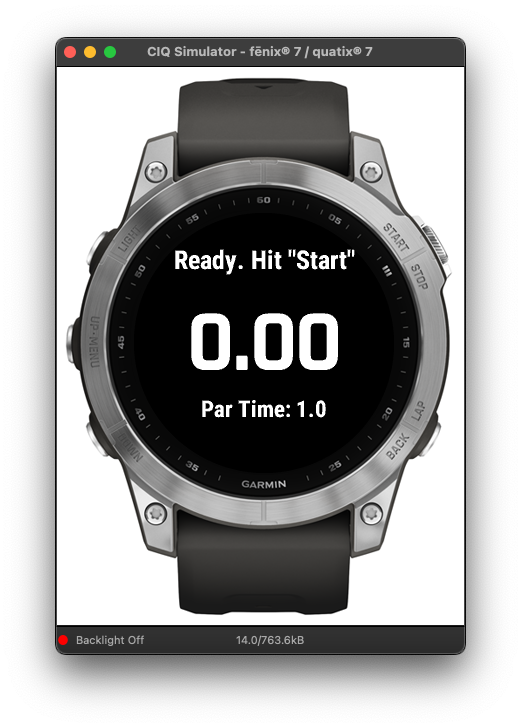
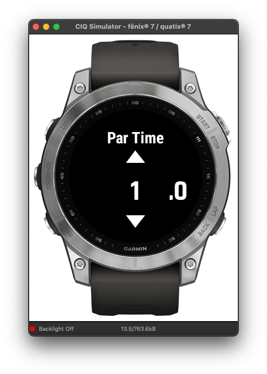

# Dry Fire Timer

This is a dry fire timer for Garmin, tested on Fenix 7. Supporting random delay of 1-4 seconds per [IPSC rule 8.3.3](https://www.ipsc.org/pdf/RulesAir.pdf), also supporting a 30 seconds par time.

## Firearm safety

Even for dry fire, always make sure you remove ammo from your weapon and area around your dry fire training. Plus observe __Four Rules of Firearm Safety__.
1. Always treat every firearm as though it is loaded.                                           
2. Always keep the muzzle pointed in a safe direction.
3. Keep your finger outside the trigger guard until ready to shoot.
4. Always be sure of your target and what is in front of it and behind it.

## Building & Running
1. Check out this project
2. On Visual Studio Code, Command Palette (Ctrl+Shift+P on Windows/Unix, Cmd+Shift+P on Mac), type "Monkey C: Build Current Project"
3. On Visual Studio Code, "Run" Menu => "Run Without Debugging"

## Deploying
1. Go to your project
2. Copy your bin/garmin_dryfiretimer.prg to your watch's GARMIN/APPS folder

## Sample Screens

